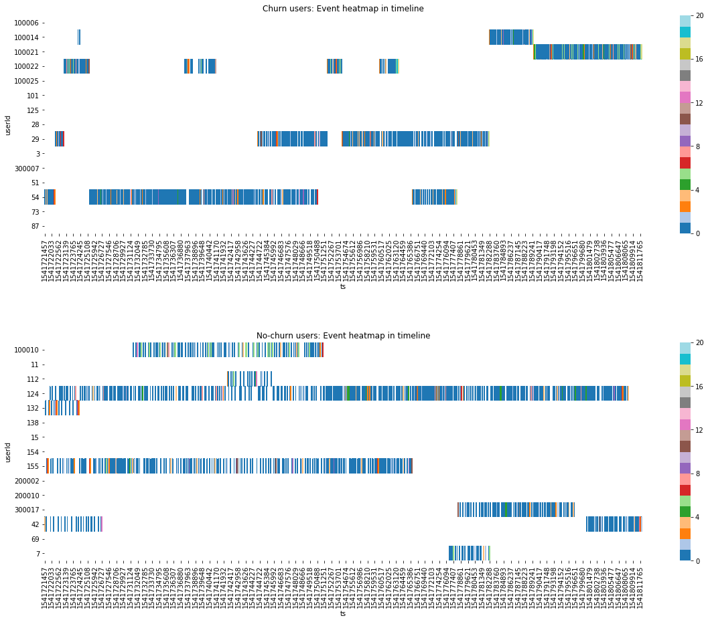
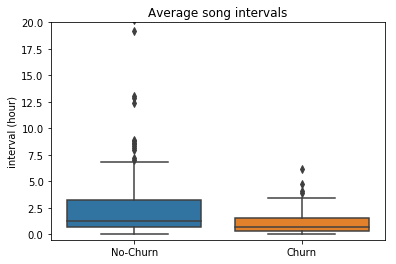
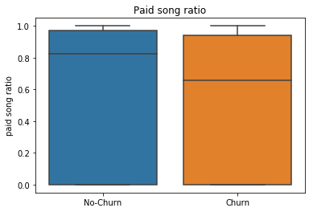
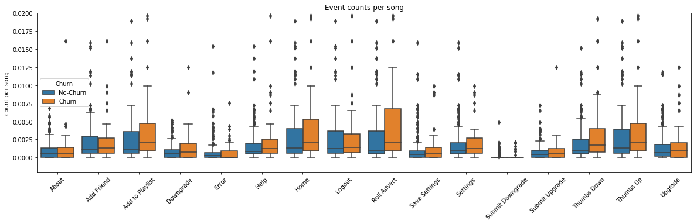
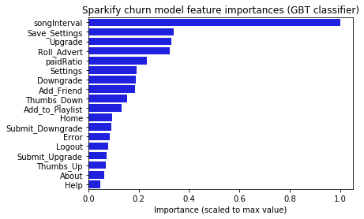
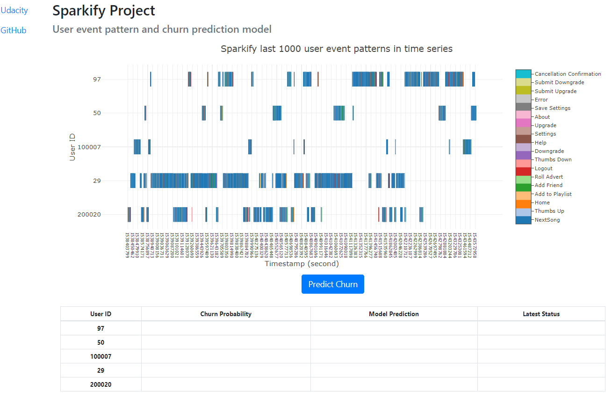
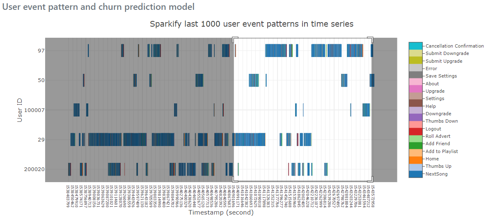
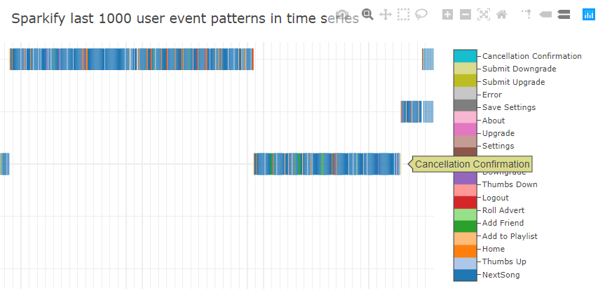
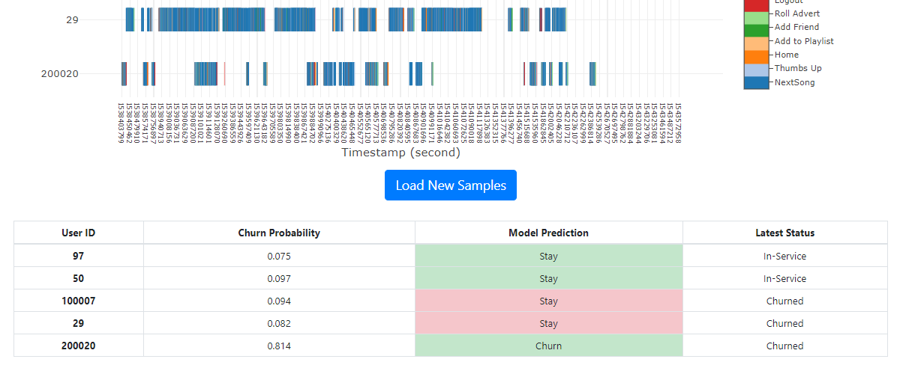

# Sparkify project
### Motivation
Churn rate is one of the important key performance indicators (KPS) for subscription model business. If we could make a model to predict churn users in advance, we could prevent them from churn by campaigns or other measures, and that could eventually save a lot of service revenue.

However, usually making such model requires very big data handling, and it is not what single computer can manage with its memory capacity. Spark is one of cluster computing platforms that can solve this data size problem by distributed parallel computing.

### Overview
Big data churn prediction model is created using Spark cluster computing for a virtual digital music service 'Sparkify'. <br>Firstly, data exploration, feature engineering and modeling are tried with Spark local mode. Then, the result is further extended to bigger data using Spark cluster mode on cloud computing platform.<br>
Models were evaluated by F1 score as this is an imbalanced data case. Feature importances are extracted from one of the models.<br>
As a demonstration of this project result, web application is prepared under 'WebApp' folder. It shows event heatmap of sampled users and predict churn of each.

### Libraries used in the project
- python 3.6
- pyspark 2.4
- scikit-learn 0.20
- numpy 1.15
- pandas 0.23
- matplotlib 3.0
- seaborn 0.9
- plotly 3.6
- flask 1.0
- openjdk 1.8 (default JRE/JDK)

### Files in the repository
- [Sparkify.ipynb](Sparkify.ipynb) : Sparkify local mode note (main document)
- [Sparkify-medium.ipynb](Sparkify-medium.ipynb) : Sparkify cluser mode note
- preproModel/ : folder saving fit preprocess pipeline
- lrModelCV/ : folder saving trained Logistic Regression model
- gbtModelCV/ : folder saving trained GBT Classifier model
- test_set_user_ids.csv : user ID list from test dataset
- WebApp: Web application Folder
  - sparkify_web_app.py : web app launch script
  - app/
    - __init__.py : web app init file
    - routes.py : web app routing script
    - wrangle_data.py : subroutines to load data and make churn predictions
    - templates/
      - index.html : main HTML file
    - static/ : static contents folder (icon files)
  - data/
    - demo_data_maker.py : script to make web app data
    - etl_pipeline.py : Sparkify ETL pipeline scripts (same as note scripts)
    - micro_sparkify_heatmap_full.pickle : heatmap data for full timestamp range
    - micro_sparkify_heatmap_1000.pickle : heatmap data for last 1000 events of each user
    - micro_sparkify_features.parquet/ : file (folder) saving cleaned and transformed features dataset
    - webPreproModel/ : folder saving trained GBT Classifier model (same as gbtModelCV/)
  - models/
    - ml_pipeline.py : Sparkify ML pipeline scripts (same as note scripts)
    - classification_metrics.py : subroutines to calculate classification metrics and plot precision-recall curve (same as note scripts)
    - webGbtModel/ : folder saving trained GBT Classifier model (same as gbtModelCV/)
- images/ : image files for markdowns files

### Files not in the repository
- mini_sparkify_event_data.json : mini size data subset
- medium_sparkify_event_data.json : medium size data subset

### Summary of the project results
#### Exploratory Data Analysis
User event timeline patterns were visualized in heatmap, comparing churn and no-churn groups. Differences were observed in event blank patterns.
<br>
Then, we visualized average song intervals, paid song ratio, and event counts per song in box plot, comparing the two groups.<br>




#### Modeling and Evaluation
Logistic Regression and Gradient Boosted-Tree Classifier are tried for modeling. While Logistic Regression showed poor performance, GBT Classifier showed pretty good scores for churn classification.<br>

**Logistic Regression model**

|LR (maxIter=200)|precison|recall|f1|AUC|AP|
|---|---|---|---|---|---|
|mini data train set|0.8333|0.4054|0.5455|0.7382|0.7414|
|mini data test set|0.4000|0.2667|0.3200|0.3189|0.3555|

|LR (maxIter=10)|precison|recall|f1|AUC|AP|
|---|---|---|---|---|---|
|medium data train set|0.8333|0.4348|0.5714|0.6514|0.6570|
|medium data test set|0.5000|0.1333|0.2105|0.5195|0.5366|

As both of train set and test set scores were not good, it is presumed that the features were exceeding learning capacity of the model.

**Gradient Boosted-Tree Classifier model**

|GBT (maxIter=50)|precison|recall|f1|AUC|AP|
|---|---|---|---|---|---|
|mini data train set|1.0000|1.0000|1.0000|1.0000|1.0000|
|mini data test set|0.5000|0.6667|0.5714|0.5174|0.5386|

|GBT (maxIter=50)|precison|recall|f1|AUC|AP|
|---|---|---|---|---|---|
|medium data train set|1.0000|1.0000|1.0000|1.0000|1.0000|
|medium data test set|0.5938|0.6333|0.6129|0.6253|0.6333|

As train set scores were 1.0 for both datasets, indicating over-fitting, it is presumed that the model scored better with larger dataset due to less over-fitting effect.

Feature importances were extracted from the GBT Classifier, and song interval was found to be the most important feature for the model.<br>
<br>
This result is supporting the observed difference of timeline event patterns in heatmap visualization.

### Web application
As a demonstration of this project result, web application is prepared under 'WebApp' folder. It shows event heatmap of sampled users and predict churn of each.<br>

**Application launch**<br>
- Move to 'WebApp' folder and run sparkify_web_app.py<br>
```$ python sparkify_web_app.py ```

**How it works**<br>
web app whole screen:<br>
<br>
> x-axis: timestamp<br>
> y-axis: randomly selected 5 user ids<br>
> colors: 19 types of events

The heatmap is drawn using Plotly so that it can use pan and zoom with mouse.<br>
<br>
> selecting area to zoom in

Hover text is available by moving cursor to each event line.<br>
<br>
> Plotly control buttons are available on top right corner

Clicking "Predict Churn" button initiate data transformation by trained model. And after a while, prediction result appears together with actual label.<br>
<br>
> light green means model prediction is correct, and pink means not

### Acknowledgements
- Sparkify data is provided by Udacity Data Scientist Nanodegree Program.
